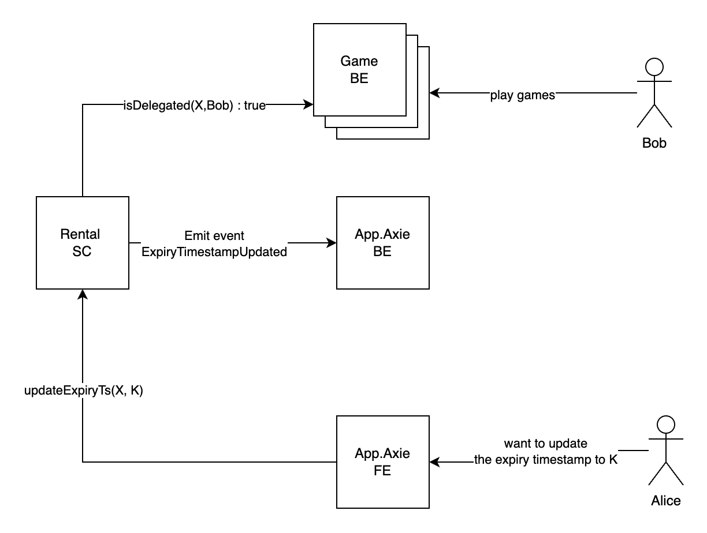
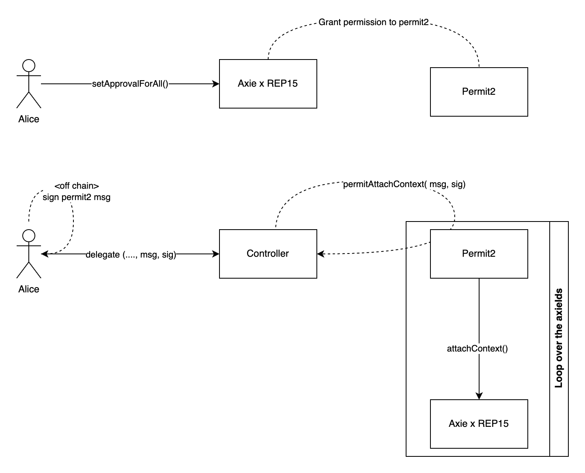

# Axie Delegation

# Specification

[Rental Marketplace + Direct Delegation](https://www.notion.so/Rental-Marketplace-Direct-Delegation-3858c6f1aafa49238dbd19109860f795?pvs=21) 

# Brainstorms

- Direct delegations:
    - assign context user to `delegatee`.
    - duration: axie_id ⇒ duration
    - borrower’s permissions:
        - play games ⇒ BE
        - earn slips ⇒ BE
        - equip accessories: ⇒ BE
    - What happens when the delegation duration is surpassed? Why do we need a duration if the owner can revoke the delegation at any time?
- Revoke delegations:
    - only owner be able to call
    - remove context user
    - ~~be able to call at any time~~. ⇒  Must wait until minimum revoke time (1D)
- Bulk delegations:
    - Limit of 20 per delegate ⇒ This is only for UI/UX purposes and does not need to be enforced at the contract layer.
    - Iterate over the axie ids and assign context user to the borrower.
- Bulk revoke:
    - Only owner can call
- Marketplace changes:
    - Owner cannot accept offer when axie is delegated? Owner must revoke it first ⇒ why?
        - On rep15, when axie is transferred, the borrower will be removed
    - While axie is delegated, the owner cannot List axie for Sale / Rent ⇒ BE

# User flows

Before delegation:

- Users must allow `Rental`  contract to use their Axies.
    - Call method `attachContext(contextHash,uint256 tokenId, bytes memory extraData)`
1. Delegation axie
    
    .png)
    
    Requirements:
    
    - Only owner of `tokenId` has authorized to call.
    - The `tokenId` should not be delegating.
    - Expiry timestamp should be in the future.
    
    Note:
    
    - `setContextLock(true)` : prevent user from requesting for detachment.
    - `isDelegated(uint256 tokenId, address delegatee) returns(true)`
        - If the delegate’s duration is surpassed, return `false`
        - If the delegate’s duration is not passed:
            - If `contextUser` == `delegatee` return `true`
            - Otherwise return `false`
2. Revoke delegation
    
    .png)
    
    Requirements:
    
    - Only owner of `tokenId` has authorized to call.
    - The `tokenId` should be delegated, even if its delegation has already expired.
    - Expiry timestamp should be in the future.
    - Must wait until `minRevokeDuration` has passed before revoking (1D, 1W, …)
3. Update expiry timestamp
    
    
    

# Interfaces

```solidity
// SPDX-License-Identifier: MIT
pragma solidity ^0.8.26;

import { IREP15 } from "@rep-0015-0.1.0-gamma/interfaces/IREP15.sol";

interface IAxieDelegation {
  error LengthMismatch(bytes4 sig);
  error ZeroAddress(bytes4 sig);
  error UnauthorizedCaller(bytes4 sig);
  error DelegationAlreadyExists(uint256 tokenId);
  error DelegationNotFound(uint256 tokenId);
  error InvalidDelegationExpiration(uint256 until);
  error RevokeTooSoon(uint256 tokenId, uint64 expected, uint64 actual);

  event AxieDelegated(uint256 indexed tokenId, address indexed owner, address indexed delegatee, uint256 expiryTs);
  event DelegationRevoked(uint256 indexed tokenId, address indexed operator);
  event MinRevokingDurationUpdated(uint64 duration);
  event ExpiryTimestampUpdated(uint256 tokenId, uint64 expiryTs, uint64 lastUpdatedAt);

  struct DelegationInfo {
    uint64 delegatedAt;
    uint64 expiryTs;
    uint64 lastUpdatedAt;
  }

  /// @dev Return context hash created in initialization.
  function contextHash() external view returns (bytes32);

  /**
   * @dev Directly delegate `tokenId` Axie to `delegatee` until `expiryTs`.
   * Requirements:
   * - Should revert if `tokenId` is already delegated.
   * - Should revert if `msg.sender` is not the owner of `tokenId`.
   * - Should revert if `expiryTs` is in the past.
   * - Should revert if `delegatee` is the zero address.
   * - Should set the context user of `tokenId` to `delegatee`.
   * - Should lock the context of `tokenId`.
   *
   * @param tokenId   The id of Axie to be delegated.
   * @param delegatee Who will be delegated to.
   * @param expiryTs  The timestamp when the delegation will be expired.
   *
   * Emit {AxieDelegated} event.
   */
  function delegate(uint256 tokenId, address delegatee, uint64 expiryTs) external;

  /**
   * @dev Bulk delegate Axies.
   * Requirements:
   * - Should revert if `tokenIds`, `delegatees`, and `expiryTimes` have different lengths.
   * - Similar requirements as `delegate` function.
   *
   * @param tokenIds The list of Axie ids to be delegated.
   * @param delegatees The list of addresses to be delegated to.
   * @param expiryTimes The list of expiry timestamps.
   *
   * Emit {AxieDelegated} event for each Axie.
   */
  function bulkDelegate(
    uint256[] calldata tokenIds,
    address[] calldata delegatees,
    uint64[] calldata expiryTimes
  ) external;

  /**
   * @dev Update the expiry timestamp of the delegation.
   * Requirements:
   * - Should revert if `tokenId` is not delegated.
   * - Should revert if `msg.sender` is not the owner of `tokenId`.
   * - Should revert if `expiryTs` is in the past.
   *
   * @param tokenId   The id of Axie to be delegated.
   * @param expiryTs  New expiry timestamp.
   *
   * Emit {ExpiryTimestampUpdated} event.
   */
  function updateExpiryTime(uint256 tokenId, uint64 expiryTs) external;

  /**
   * @dev Revoke the delegation of `tokenId`.
   * Requirements:
   * - Should revert if `tokenId` is not delegated.
   * - Should revert if `msg.sender` is not the owner of `tokenId`.
   * - Must wait for `getMinRevokingDuration` seconds from the delegation time to revoke.
   * - Should delete the delegation info of `tokenId`.
   * - Should unlock the context of `tokenId`.
   * - Should set the context user of `tokenId` to the zero address.
   *
   * @param tokenId The id of Axie to be revoked.
   *
   * Emit {DelegationRevoked} event.
   */
  function revokeDelegation(uint256 tokenId) external;

  /**
   * @dev Bulk revoke delegations.
   * Requirements:
   * - Should revert if `tokenIds` have different lengths.
   * - Similar requirements as `revokeDelegation` function.
   *
   * @param tokenIds The list of Axie ids to be revoked.
   */
  function bulkRevokeDelegations(uint256[] calldata tokenIds) external;

  /**
   * @dev Return the delegation info of `tokenId`.
   * @param tokenId The id of Axie.
   * @return delegatee The delegatee of `tokenId`. Zero address if not delegated.
   * @return delegatedAt The timestamp when the delegation was created.
   * @return expiryTs The timestamp when the delegation will be expired.
   */
  function getDelegationInfo(
    uint256 tokenId
  ) external view returns (address delegatee, uint64 delegatedAt, uint64 expiryTs);

  /**
   * @dev Return whether `tokenId` is delegated to `user`.
   * Requirements:
   * - Should revert if `user` is the zero address.
   * - Return false if the delegation has expired.
   * - Return false if `tokenId` is not delegated to `user`.
   * - Return true if `tokenId` is delegated to `user` and not expired.
   * @param tokenId The id of Axie.
   * @param user The address to check whether being delegated.
   */
  function isDelegated(uint256 tokenId, address user) external view returns (bool);

  /// @dev Return the minimum duration to revoke the delegation.
  function getMinRevokingDuration() external view returns (uint64);

  /// @dev Set the minimum duration to revoke the delegation. Only admin has authorized to call.
  function setMinRevokingDuration(uint64 duration) external;

  /// @dev Return the Axie contract.
  function getAxieContract() external view returns (IREP15);

  /// @dev Update the detaching duration. Only admin has authorized to call.
  function updateDetachingDuration(uint64 detachingDuration) external;
}
```

# Axie x REP15 Improvements:

Challenge 1: Precondition for delegating a new axie to is that the owner have to attach the context of `AxieDelegation` to that axie. It causes bad experiences for whales players who have thousand of Axies, they have to make a thousand of on-chain transactions accordingly. 

Solutions: 

- Add method to Axie `batchAttachContexts(bytes32[] contextHashes, uint256[] tokenIds, bytes[] calldata datas)`
- Permit2:



Solution: inspired by [Permit2](https://github.com/dragonfly-xyz/useful-solidity-patterns/tree/main/patterns/permit2) idea, a middle contract called `Permit2`  could be a solution.

1.  Alice calls `setApprovalForAll(address, bool)` for grant all permissions for `Permit2` contract. 
2. Alice sign off-chain “permit2” message that allow `Controller` contract to attach itself context to the axie.
    1. The type hash: 
    
    ```solidity
    Permit(bytes32 contextHash,uint256[] axieIds,bytes[] data,address controller,uint256 deadline,uint256 nonce);
    ```
    
3. Anyone can submit above signature and permit2 message to `Controller` contract
4. The `Controller` contract calls `permitAttachContext` on `Permit2` contract, then `Permit2` contract should verify the message and signature are both valid.
5. When the verification is done, `Permit2` contract will loop over the list of axie ids and call attach context.

Risk considerations:

- At step 1, Alice grants `Permit2` full permissions over her assets, which could pose a vulnerability and potentially make `Permit` as a target.
    - Solution: Replace `setApprovalForAll` by the `setPermissionFor(address _operator, bytes4 _funcSig, bool _approved)`  where `_funcSig` is restricted to the function selector of `attachContext`
        - Props: Do not violate the mission of REP15, don’t touch to the transfer permission of assets.
        - Cons: Only support tokens that inherit the `ERC721Permission` (Axie, not Land)

# Test plan

TBA

# Improvement

Auto unlock context when token delegation is revoked.